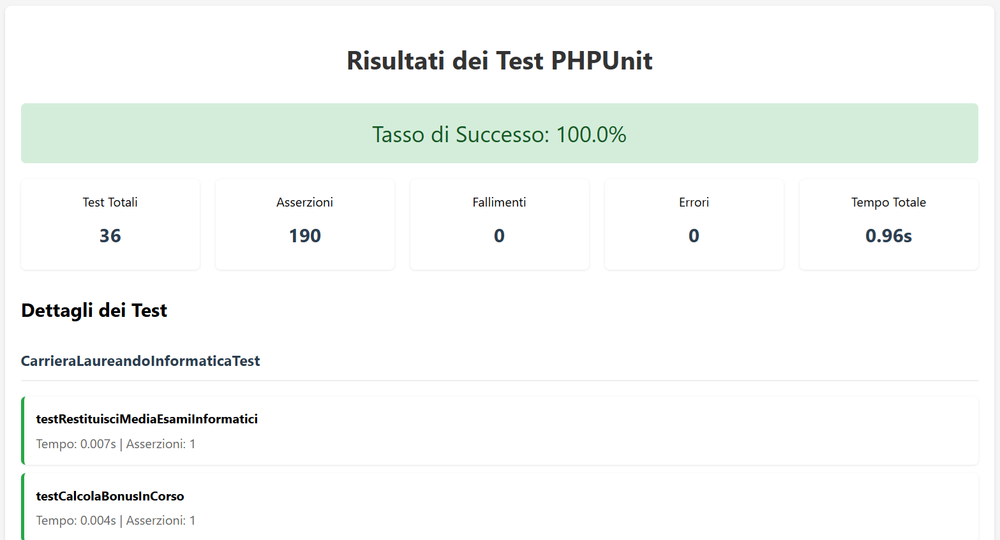

# Progetto Laureandosi

## Descrizione
Progetto realizzato per l'esame di Ingegneria del Software.<br>
<!-- Aggiungi immagine-->

Il progetto consiste nel realizzare il portale **Laureandosi** per la gestione dei prospetti di laurea.
Il linguaggio di programmazione utilizzato è **PHP** e il framework **WordPress**.
Per realizzare il progetto è stato utilizzato il software **LocalWP**.
È stato inoltre fondamentale l'uso di PHPunit per la realizzazione dei test.

## Per Iniziare
1. Questo progetto è configurato utilizzando LocalWP per lo sviluppo WordPress
2. Segui le istruzioni di installazione per LocalWP
3. Configura il tuo ambiente locale

## Requisiti
- LocalWP (https://localwp.com/)
- Libreria FPDF
- Libreria PHPMailer

## Installazione
1. Clona questo repository
2. Apri con LocalWP il progetto
3. Aggiungi la cartella `lib` contenente le librerie FPDF e PHPMailer all'interno di `app/`
3. Avvia il server locale

## Installazione PHPunit

- Installare php dal seguente link: https://windows.php.net/download/ (x64 Non Thread Safe)
- Installare composer dal seguente link: https://getcomposer.org/Composer-Setup.exe
- Per installare php-unit dare il seguente comando nella cartella del progetto (all'interno di `src/`):

```pwsh
composer require --dev phpunit/phpunit
```

## Testing
Una volta installato PHPunit, verificare che sia presente il file `phpunit.xml` all'interno di `app/`
Dopodichè è possibile eseguire i test.

Vanno seguiti i seguenti passaggi:
1. Aprire il terminale nella cartella del progetto (all'interno di `app/`) e dare il seguente comando:

```pwsh
./vendor/bin/phpunit
```

Il comando eseguirà tutti i test e creerà all'interno della cartella `app/public` un file `tests_results.html` contenente i risultati dei test.
2. Per vedere i risultati, è sufficiente visitare la pagina `http://laureandosi.local/tests_results.html`.
Nella pagina verranno visualizzati i risultati dei test, come mostrato nell'immagine seguente (esempio):



## Licenza
<p xmlns:cc="http://creativecommons.org/ns#" xmlns:dct="http://purl.org/dc/terms/"><a property="dct:title" rel="cc:attributionURL" href="https://github.com/AndreaCovelli/laureandosi">Laureandosi</a> by <a rel="cc:attributionURL dct:creator" property="cc:attributionName" href="https://github.com/AndreaCovelli">Andrea Covelli</a> is licensed under <a href="https://creativecommons.org/licenses/by-nc-nd/4.0/?ref=chooser-v1" target="_blank" rel="license noopener noreferrer" style="display:inline-block;">CC BY-NC-ND 4.0</a></p> 