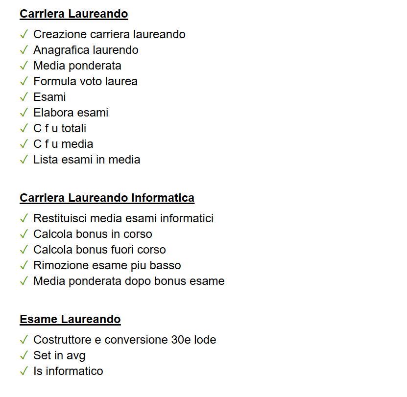

# Documentazione

## Introduzione

Il progetto **Laureandosi** è stato realizzato per l'esame di Ingegneria del Software.<br>
Il progetto consiste nel realizzare il portale **Laureandosi** per la gestione dei prospetti di laurea.
Il linguaggio di programmazione utilizzato è **PHP** e il framework **WordPress**.
Per realizzare il progetto è stato utilizzato il software **LocalWP**, un ambiente di sviluppo Wordpress. È stato inoltre fondamentale l'uso di **PHPunit** per la realizzazione dei test.

## Per Iniziare

1. Questo progetto è configurato utilizzando LocalWP per lo sviluppo WordPress
2. Segui le istruzioni di installazione per LocalWP
3. Aggiungi la cartella lib contenente le librerie FPDF e PHPMailer all'interno di app/public

## Requisiti

- LocalWP (https://localwp.com/)
- Libreria FPDF
- Libreria PHPMailer

## Installazione

1. Sovrascrivi la cartella `app/public` con quella presente nel repository
2. Modifica il file `nginx.conf.hbs` inserendo il seguente codice:

```bash
    # Allow directory listing for output folder
	# server per poter accedere ai file generati da PHP in output
    location ^~ /output/ {
        autoindex on;
        autoindex_exact_size off;
        autoindex_localtime on;
    }
```

3. Installa PHPunit

- Installare php dal seguente link: https://windows.php.net/download/ (x64 Non Thread Safe)
- Installare composer dal seguente link: https://getcomposer.org/Composer-Setup.exe
- Per installare php-unit dare il seguente comando nella cartella del progetto (all'interno di `\src`):

```bash
composer require --dev phpunit/phpunit:^9.0
```

## Configurazione

La struttura del progetto è la seguente:

```
+---app
|   +---public
|   |   |   index.php
|   |   |   styles.css
|   |   |   tests.php
|   |   |   tests_styles.css
|   |   |   
|   |   \---output
|   |                   
|   +---src
|   |   +---classes
|   |   |       CarrieraLaureando.php
|   |   |       CarrieraLaureandoInformatica.php
|   |   |       EsameLaureando.php
|   |   |       GestioneCarrieraLaureando.php
|   |   |       GestioneInvioEmail.php
|   |   |       GestioneParametri.php
|   |   |       Prospetto.php
|   |   |       ProspettoPDFCommissione.php
|   |   |       ProspettoPDFLaureando.php
|   |   |       ProspettoPDFLaureandoSimulazione.php
|   |   |       
|   |   +---config_files
|   |   |       esami_informatici.json
|   |   |       filtro_esami.json
|   |   |       parametri_voto_laurea.json
|   |   |       
|   |   \---data
|   |           123456_anagrafica.json
|   |           123456_esami.json
|   |           123456_output.pdf
|   |           234567_anagrafica.json
|   |           234567_esami.json
|   |           234567_output.pdf
|   |           345678_anagrafica.json
|   |           345678_esami.json
|   |           345678_output.pdf
|   |           456789_anagrafica.json
|   |           456789_esami.json
|   |           456789_output.pdf
|   |           567890_anagrafica.json
|   |           567890_esami.json
|   |           567890_output.pdf
|   |           
|   \---tests
|           CarrieraLaureandoInformaticaTest.php
|           CarrieraLaureandoTest.php
|           EsameLaureandoTest.php
|           GestioneCarrieraLaureandoTest.php
|           GestioneInvioEmailTest.php
|           GestioneParametriTest.php
|           image.png
|           ProspettoPDFCommissioneTest.php
|           ProspettoPDFLaureandoSimulazioneTest.php
|           ProspettoPDFLaureandoTest.php
|           
\---conf
    \---nginx
            site.conf.hbs
```

### parametri_voto_laurea.json

Il file `parametri_voto_laurea.json` contiene le formule per il calcolo dei crediti e della media.

```json
{
    "degree_programs": {
        "T. Ing. Informatica": {
        "formula": "M*3+18+T+C",
        "required_cfu": 177,
        "parameters": {
            "par-T": {
            "min": 0,
            "max": 0,
            "step": 0
            },
            "par-C": {
            "min": 1,
            "max": 7,
            "step": 1
            }
        },
        "notes": "Bonus: si toglie l'esame con voto minore e, a parità di voto minore, quello con più crediti, se ci si laurea entro maggio del terzo anno."
        }
    }
}
```
Ciascun campo ha il seguente significato:
- `degree_programs`: contiene i programmi di laurea
- `formula`: formula per il calcolo dei crediti e della media
- `required_cfu`: cfu richiesti per la laurea
- `parameters`: parametri della formula
    - `min`: valore minimo
    - `max`: valore massimo
    - `step`: passo
- `notes`: note aggiuntive

### esami_informatici.json

Il file `esami_informatici.json` contiene la lista degli esami informatici. Un esempio è il seguente:

```json
{
  "T. Ing. Informatica": [
    "FONDAMENTI DI PROGRAMMAZIONE",
    "ALGORITMI E STRUTTURE DATI",
    "BASI DI DATI",
    "PROGETTAZIONE WEB",
    "RETI LOGICHE",
    "CALCOLATORI ELETTRONICI",
    "INGEGNERIA DEL SOFTWARE",
    "PROGRAMMAZIONE AVANZATA",
    "RETI INFORMATICHE",
    "SISTEMI OPERATIVI",
    "PROGETTAZIONE DI RETI INFORMATICHE"
  ]
}
```

### filtro_esami.json

Il file `filtro_esami.json` contiene la lista degli esami filtrati. Un esempio è il seguente:

```json
{
  "T. Ing. Informatica": {
		"_comment": {
			"*": "indica che vale per tutte le matricole",
			"xxxxxx": "indica che vale solo per la matricola xxxxxx"
		},
		"*": {
			"esami-non-avg": [
				"PROVA DI LINGUA INGLESE (B1)",
				"PROVA DI LINGUA INGLESE",
				"PROVA DI LINGUA INGLESE B2",
				"TIROCINIO",
				"PROVA FINALE",
				"TEST DI VALUTAZIONE DI INGEGNERIA",
				"LIBERA SCELTA PER RICONOSCIMENTI"
			],
			"esami-non-cdl": [
				"PROVA FINALE",
				"LIBERA SCELTA PER RICONOSCIMENTI",
				"TEST DI VALUTAZIONE DI INGEGNERIA"
			]
		},
        "345678": {
			"esami-non-avg": [
				"RICERCA OPERATIVA"
			],
			"esami-non-cdl": [
			]
		}
    }
}
``` 

I campi hanno il seguente significato:
- `*`: indica che vale per tutte le matricole
- `xxxxxx`: indica che vale solo per la matricola xxxxxx
- `esami-non-avg`: esami non considerati per il calcolo della media
- `esami-non-cdl`: esami che non vanno mostrati nel prospetto

## Guida all'uso

L'interfaccia del portale è composta da tre sezioni principali:
- **Crea Prospetto**: permette di creare il prospetto di un laureando
- **Apri Prospetto**: permette di aprire due schede nel browser: una contente la cartella con tutti i prospetti, commissione e laureando, l'altra contente il prospetto della commissione
- **Invia prospetti**: permette di inviare i prospetti laureando a tutti i laureandi (ciascun laureando riceverà il proprio prospetto)

### Crea Prospetto

Per questa operazione è necessario effettuare i seguenti passaggi:
1. Scegliere dal menù a tendina il corso di laurea
2. Scegliere la data di laurea
3. Inserire la lista della matricole separate da una virgola (es. 123456, 234567, 345678)
4. Premere il pulsante **Crea Prospetto**

### Apri Prospetto

Per questa operazione aver già effettuato la *Crea Prospetto*. I passaggi da seguire sono i seguenti:
1. Premere il pulsante **Apri Prospetto**

### Invia prospetti

Per questa operazione aver già effettuato la *Crea Prospetto*. I passaggi da seguire sono i seguenti:
1. Premere il pulsante **Invia prospetti**
2. Attendere il completamento dell'operazione al termine della quale comparirà un messaggio di conferma

## Testing

Per eseguire i test, è sufficiente visitare la pagina `http://laureandosi.local/tests.php`. Nella pagina verranno visualizzati i risultati dei test, come mostrato nell'immagine seguente:

